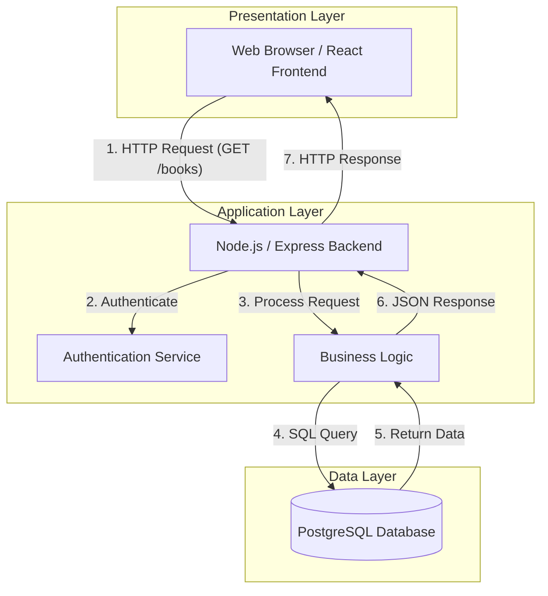

# System Overview and Problem Statement
**System:** Library Management System
**Problem Statement:** The current library operates using a manual, paper-based system to track book inventory and user borrowing records. This leads to inefficiencies, lost records, and difficulty checking book availability. The goal is to build a web-based information system that allows librarians to manage books easily and allows users to search and reserve books online.

# Three-Tier Architecture
The system uses a classic three-tier client-server architecture:
1. **Presentation Layer (Client-Side):** A web interface accessed via a browser (HTML/CSS/JavaScript/React).
2. **Application Layer (Server-Side):** The backend logic and API (Node.js/Express).
3. **Data Layer (Database):** The database storing all persistent information (PostgreSQL/MySQL).

# Responsibilities of Each Component
### 1. Presentation Layer
- Renders the User Interface (UI) for users (students) and administrators (librarians).
- Handles user input, form validation, and displays data fetched from the application layer.

### 2. Application Layer
- Acts as the middleman between the presentation and data layers.
- Processes business logic: checking if a book is available, calculating late fees, managing user authentication.
- Provides RESTful APIs for the frontend to consume.

### 3. Data Layer
- Responsible for secure data storage, retrieval, and integrity.
- Stores information about books, users, and borrowing transactions.

# Architecture Diagram and Data Flow

**Data Flow Description:**
1. The user requests a list of books via the frontend UI.
2. The frontend sends an HTTP request to the backend API.
3. The application layer checks permissions, processes the request, and forms a database query.
4. The query is executed against the database.
5. The database returns the book records to the application layer.
6. The application layer formats the data into JSON and sends it back to the presentation layer.

# Proposed Database Plan
The relational database will consist of three main tables:
1. **Users Table:** `user_id` (PK), `name`, `email`, `password_hash`, `role` (student/librarian).
2. **Books Table:** `book_id` (PK), `title`, `author`, `isbn`, `status` (available/borrowed).
3. **Transactions Table:** `transaction_id` (PK), `user_id` (FK), `book_id` (FK), `borrow_date`, `return_date`.

# Architectural Design Justification
A three-tier architecture was chosen because:
- **Separation of Concerns:** Each layer handles a specific aspect of the system. UI designers can work independently of database engineers.
- **Scalability:** If the application logic becomes resource-heavy, the application server can be scaled independently of the database.
- **Security:** The database is hidden behind the application layer. Direct access from the client is impossible, allowing the application layer to enforce security rules before database interaction...
